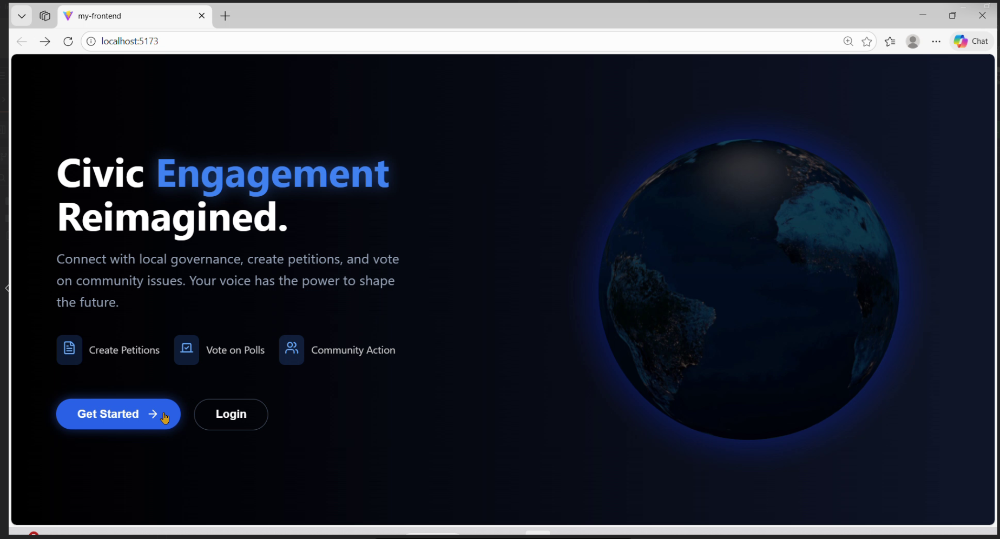

# 🏛️ Digital Civic Engagement Platform

[](https://drive.google.com/file/d/1ynWTj8uE_jVHdnjjfoUsA8ySZAqxmLvL/view?usp=sharing)

🚀 **Live Demo:** *(Add after deployment)*
🎥 **Full Demo Video:** https://drive.google.com/file/d/1ynWTj8uE_jVHdnjjfoUsA8ySZAqxmLvL/view?usp=sharing

---

## 📌 Overview

The **Digital Civic Engagement Platform** is a full-stack MERN application designed to bridge the gap between citizens and government authorities. It enables users to raise concerns, participate in decision-making, and track public issues transparently.

This platform promotes **transparency, accountability, and active civic participation** through digital tools.

---

## 🚀 Key Features

### 👥 User Roles

* **Citizens**

  * Create and manage petitions
  * Sign petitions
  * View community reports

* **Officials (Upcoming)**

  * Analyze citizen feedback
  * View jurisdiction-based issues

---

### 🔐 Authentication & Security

* JWT-based Authentication
* Password hashing using BCrypt
* Protected API routes

---

### 📊 Core Functionalities

* 📝 Petition creation and management
* ✍️ Petition signing with duplicate prevention
* 🔍 Smart filtering (Category, Status, Location)
* 📈 User dashboard with activity insights
* 📍 Location-based features using Leaflet
* 📊 Data visualization using Recharts

---

## 🛠️ Tech Stack

### Frontend

* React.js
* React Router
* Axios
* Tailwind CSS
* Lucide Icons

### Backend

* Node.js
* Express.js

### Database

* MongoDB Atlas

### Tools & Libraries

* JWT (Authentication)
* BCrypt (Security)
* Recharts (Charts)
* Leaflet (Maps)

---

## ⚙️ Local Setup Guide

### 1️⃣ Prerequisites

* Node.js (v14+)
* MongoDB Atlas / Local MongoDB
* Git

---

### 2️⃣ Clone Repository

```bash
git clone <YOUR_GITHUB_REPO_LINK>
cd Digital-civic-nov-team01
```

---

### 3️⃣ Backend Setup

```bash
cd backend
npm install
```

Create `.env` file:

```env
PORT=5000
MONGO_URI=your_mongodb_connection_string
JWT_SECRET=your_secret_key
```

Run backend:

```bash
npm start
```

---

### 4️⃣ Frontend Setup

```bash
cd frontend
npm install
npm install recharts leaflet react-leaflet axios lucide-react react-router-dom
npm start
```

App runs at:
👉 http://localhost:3000

---

## 📁 Project Structure

```
Digital-civic-nov-team01/
│
├── backend/
│   ├── config/
│   ├── controllers/
│   ├── models/
│   ├── routes/
│   ├── middleware/
│   └── index.js
│
└── frontend/
    ├── src/
    │   ├── components/
    │   ├── context/
    │   ├── pages/
    │   └── api.js
```

---

## 🔗 API Endpoints

| Method | Endpoint                | Description       |
| ------ | ----------------------- | ----------------- |
| POST   | /api/auth/register      | Register user     |
| POST   | /api/auth/login         | Login user        |
| GET    | /api/petitions          | Get all petitions |
| POST   | /api/petitions          | Create petition   |
| POST   | /api/petitions/:id/sign | Sign petition     |

---

## 🤝 Contribution

* Fork the repository
* Create a branch (`git checkout -b feature-name`)
* Commit changes
* Push and open a Pull Request

---

## ⭐ Future Improvements

* Official analytics dashboard
* Real-time notifications
* Petition approval workflow
* Mobile responsiveness improvements

---

## 📬 Contact

📧 [your-email@example.com](mailto:your-email@example.com)

---

## 🌟 Final Note

This project showcases **full-stack development, authentication, API design, and real-world problem solving**, making it highly relevant for software engineering roles.
